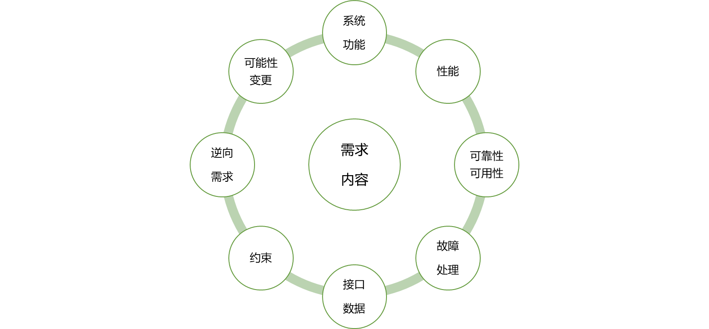
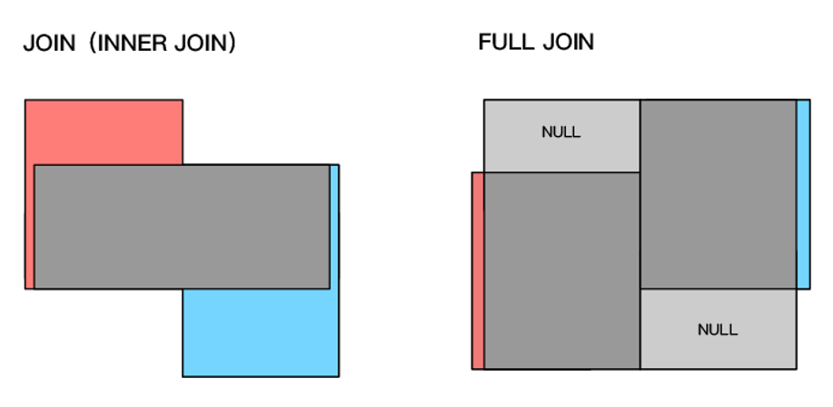

# 数据仓库与建模技术
> Lead-Authors：陈子谦 (Robert Chen)，刘方磊 (Amos Liu)
>
> Date：2023.11.17
>

注意：

- 本文档考虑篇幅和工作量不可能覆盖所有的代码语句，只会重点举例，其余的请来访者使用大模型和网络资源自行了解
- **我们在进行举例的时候会尽可能用到多的参数以给大家带来尽可能全面的了解**
- 推荐 W3School 的 SQL 教程：https://www.w3school.com.cn/sql/index.asp
- 已经注册 Rhine Assistant 的来访者可使用谦谦自营的大模型工具：[Rhine Assistant](https://ai.haut.ink/)

## 一、数据库和数据库建模

1. ### SQL语言分类

- SQL是操作和检索关系数据库的事实上的标准语言

- SQL 分为 DDL（数据定义语言）、DML（数据操作语言） 和 DCL（数据控制语言） 三部分

- ⭐ **我们需要重点学习** **DDL** **和** **DML**，首先来重温一下 DDL

  - DDL 拥有创建，删除，更改数据库对象的能力，也可以定义索引，规定表之间的链接，施加约束等

  - 

  - ```SQL
    -- 创建表举例
    CREATE TABLE students (
      id INT PRIMARY KEY, -- 设置主键
      name VARCHAR(50) NOT NULL, -- 不能为空
      age INT CHECK (age >= 18), -- 值大于等于18
      gender ENUM('Male', 'Female'), -- 枚举类型，取值只能从中选择
      email VARCHAR(100) UNIQUE, -- 唯一性
      created_at TIMESTAMP DEFAULT CURRENT_TIMESTAMP -- 设置时间戳
    );
    
    -- 复制表结构
    create table 新表名 like 旧表名
    -- 或者
    create table 新表名 select * from 旧表名
    
    -- 修改表举例（注：被 [] 包围的表示可选字段，下同）
    alter table 表名 add 新字段名 新数据类型 [ 新约束条件 ] [ first | after 旧字段名] -- 添加字段
    alter table 表名 drop 字段名 -- 删除字段
    alter table 表名 change 旧字段名 新字段名 新数据类型 -- 修改字段名称
    alter table 表名 modify 字段名 新数据类型 -- 修改字段的数据类型
    alter table 旧表名 rename 新表名 -- 修改表名
    alter table 表名 add index 索引名 (字段名) -- 添加索引
    
    -- 删除表举例
    drop table 表名
    
    -- 索引举例
    CREATE TABLE table_name (
      column1 data_type,
      column2 data_type,
      ...
      INDEX index_name (column_name1, column_name2, ...)
    ); -- 创建表时添加索引
    create index 索引名 on 表名(字段名) -- 创建索引
    CREATE UNIQUE INDEX 索引名 ON 表名(字段名); -- 创建唯一索引
    drop index 索引名 on 表名 -- 删除索引
    ```

- 接下来是 DML

  - 查询和更新部分构成了 DML 部分

  - 

  - ```SQL
    -- SELECT 语法举例
    select 字段 from 数据源 [where 条件] [group by 分组字段 [having 条件]] [order by 排序字段]
    select distinct xxxxxxx -- 去重查询
    select xxx from xxx [inner] join 连接表名 on 条件 -- 内连接
    select xxx from xxx left/right join 连接表名 on 条件 -- 左/右连接
    
    -- UPDATE 语法举例
    UPDATE 表名称 SET 字段 = 新值 WHERE 条件
    
    -- DELETE 语法举例
    delete from 表名 where 条件
    truncate table 表名 -- 完全清空一个表
    
    -- INSERT 语法举例
    insert into 表名 [(字段列表)] values (值列表) -- 也可以用 SELECT 充当插入的数据 
    ```

  - ⭐ 谦谦讲座：什么是内连接，左连接，右连接

    - Amos提醒：所谓左表和右表的区别就是如（A XXXX JOIN B）中在XXXX JOIN左边的A叫左表，在XXXX JOIN右的B叫右表

    - 现在我们有两个表：员工表（employees）和部门表（departments）

      - | 员工ID | 姓名 | 部门ID |
        | ------ | ---- | ------ |
        | 1      | 小明 | 1      |
        | 2      | 小红 | 2      |
        | 3      | 小李 | NULL   |

      - | 部门ID | 部门名称 |
        | ------ | -------- |
        | 1      | 销售部   |
        | 2      | 技术部   |
        | 3      | 人事部   |

    - 左连接以左表为主表，返回**左表中的所有记录以及与之匹配的右表记录**。如果某个员工在部门表中没有对应的记录，则返回 NULL 值，这里给出语句示例，将输出下面表格的结果，由于员工表中小李的部门 ID 为 NULL，所以在左连接的结果中，对应的部门名称显示为 NULL

    - ```SQL
      SELECT employees.员工ID, employees.姓名, departments.部门名称
      FROM employees
      LEFT JOIN departments ON employees.部门ID = departments.部门ID;
      ```

    - | 员工ID | 姓名 | 部门名称 |
      | ------ | ---- | -------- |
      | 1      | 小明 | 销售部   |
      | 2      | 小红 | 技术部   |
      | 3      | 小李 | NULL     |

    - 右连接以右表为主表，**返回右表中的所有记录以及与之匹配的左表记录**。如果某个部门在员工表中没有对应的记录，则返回 NULL 值。同样给出语句示例，在这个结果中，由于部门表中人事部的 部门 ID 在员工表中没有对应的记录，所以在右连接的结果中，对应的员工 ID 和姓名显示为 NULL

    - ```SQL
      SELECT employees.员工ID, employees.姓名, departments.部门名称
      FROM employees
      RIGHT JOIN departments ON employees.部门ID = departments.部门ID;
      ```

    - | 员工ID | 姓名 | 部门名称 |
      | ------ | ---- | -------- |
      | 1      | 小明 | 销售部   |
      | 2      | 小红 | 技术部   |
      | NULL   | NULL | 人事部   |

    - 内连接将两个表中满足指定连接条件的记录连接成新的结果集，**舍弃所有不满足连接条件的记录**。因此假如依据 部门ID 字段对两表进行内连接，将输出以下结果

    - ```SQL
      SELECT employees.员工ID, employees.姓名, departments.部门名称
      FROM employees
      INNER JOIN departments ON employees.部门ID = departments.部门ID;
      ```

    - | 员工ID | 姓名 | 部门名称 |
      | ------ | ---- | -------- |
      | 1      | 小明 | 销售部   |
      | 2      | 小红 | 技术部   |

- 对于 DCL，现阶段我们常用的是权限管理命令（GRANT 和 REVOKE）


```SQL
-- 举例：授权一个用户 SELECT 权限，可以查询表的数据
GRANT SELECT ON table_name TO user_name;
-- 撤销该用户的 SELECT 权限
REVOKE SELECT ON table_name FROM user_name;

-- 创建事务并提交修改，执行后所有修改会被持久化保存
BEGIN TRANSACTION;
COMMIT;
-- 回滚数据库到上一个提交点
ROLLBACK;
```

⭐ 总结一下 SQL 的作用

- 增加用户访问数据库或表的许可
- 修改数据库的结构
- 改变系统的安全性设置
- 查询数据库的信息
- 更新数据库的内容

1. ### 数据库建模

#### A. 概念引入

- 数据库建模是对现实世界进行分析、抽象、并从中找出内在联系，进而确定数据库的结构的过程。它主要包括两部分内容：确定最基本的数据结构和以及它们之间的约束
- 好的模型结构可以节省数据的存储空间，保证数据的完整性，方便进行数据库应用系统的开发；不好的数据结构会造成数据冗余以及内存和存储的浪费，操作异常等
- 规范的设计方法遵循规范的基本思想，过程迭代和逐步求精，变更可控、维护成本低；非规范的设计缺乏科学理论和工程方法的支持，质量难以保证且与设计人员水平直接相关，出问题概率高，增加维护代价
- 数据建模一般使用【实体-联系】建模，也叫它 ER 建模
- ER建模理论有以下基本概念
  - 实体：客观存在并可区分的事物
  - 属性：实体具有的特性，一个实体可以对应若干个属性
  - 码：唯一标识实体的属性集
  - 域：属性的取值范围
  - 实体集：同一类型的实体集合
  - 实体型：同类实体的抽象
  - 联系：事物之间或事物内部的联系，内部是属性之间的关系，外部是不同实体集之间的联系
- **实体型关系类别：一对一、一对多、多对多**
- ⭐ **实体联系建模步骤**
  - 
  - 确认实体型：比如图中有用户、订购信息和产品三个实体型
  - 收集实体属性：比如用户有姓名、性别等属性
  - 确认实体间关系：【用户】通过【订购】这个联系，和【产品】构成多对多关系
  - 实体联系属性：将收集的每个实体的属性分别与之连接
  - 画出 ER 图，如图所示
  - 
- 常见的数据库建模工具有 ERWin、PowerDesigner 等

#### B. 数据库建模过程

##### I. 需求分析

- 顾名思义，分析用户的需求，确认建模的目标

##### Ii. 概念设计

- 概念结构设计就是将需求分析得到的用户需求抽象为信息结构即概念模型的过程
- 概念结构的主要特点：反映现实世界，包括实体间联系，易于理解、调整、修改和向不同数据模型转换
- 设计概念结构的四类常用方法：自顶而下，自底而上，逐步扩张，混合策略
- ⭐ **概念设计模型的主要元素**
  - 实体：可以是具体的也可以是抽象的
  - 属性：实体是由一组属性来表示的
  - 关系：两个或多个实体之间的联系
- 概念结构设计步骤
  - 找出问题领域中的候选概念
  - 将概念添加到概念模型图中
  - 为概念分类、分域
  - 给概念添加关联关系
  - 给概念添加属性

##### Iii. ⭐ 逻辑设计

- 逻辑结构设计是在概念设计的基础上对实体以及实体关系的细化

- ⭐⭐ **谦谦重点讲解部分：三****范式****（1NF，2NF，3NF）**

  - 业务系统建模通常采用范式建模

  - 1NF：必须有主键，每一个列值必须是不可分的数据项（每个属性必须是原子的）

  - 2NF：每一个列值必须依赖**整个**主键

  - 3NF：每一个列值和主键直接相关

  - Amos提醒：1NF范式消除了非原子属性；2NF范式消除了非键属性只依赖于主键的一部分的情况；3NF范式消除了非键属性的传递依赖

  - 现在有一个学生信息表

  - | 学号 | 姓名 | 课程             | 分数   |
    | ---- | ---- | ---------------- | ------ |
    | 1    | 小明 | 数学, 物理       | 85, 80 |
    | 2    | 小红 | 英语             | 90     |
    | 3    | 小刚 | 数学, 计算机科学 | 75, 95 |

  - 很明显它不满足 1NF，因为每一列的数据仍是可分的，因此需要进行改造

  - | 学号 | 姓名 | 课程       | 分数 |
    | ---- | ---- | ---------- | ---- |
    | 1    | 小明 | 数学       | 85   |
    | 1    | 小明 | 物理       | 80   |
    | 2    | 小红 | 英语       | 90   |
    | 3    | 小刚 | 数学       | 75   |
    | 3    | 小刚 | 计算机科学 | 95   |

  - 现在它满足 1NF 了，但是它不满足 2NF。通过分析上表，**来访者可以发现【学号】和【课程】两个字段可以唯一确定一条记录，所以它们合起来可以作为一个整体的组合****主键**，但是你会发现【姓名】字段只依赖【学号】，这不符合 2NF 中“依赖整个主键”的思想，所以需要对这个表进行拆分，拆分成学生表和成绩表

  - | 学号 | 姓名 |
    | ---- | ---- |
    | 1    | 小明 |
    | 2    | 小红 |
    | 3    | 小刚 |

  - | 学号 | 课程       | 分数 |
    | ---- | ---------- | ---- |
    | 1    | 数学       | 85   |
    | 1    | 物理       | 80   |
    | 2    | 英语       | 90   |
    | 3    | 数学       | 75   |
    | 3    | 计算机科学 | 95   |

  - 现在它满足 2NF 和 3NF（因为每一个列值都和主键直接相关） 了。那现在谦谦要考考你，如果我对成绩表进行改动，加入一个【阅卷教师】列（假定每门课的阅卷教师是唯一的），来访者看一看它还符合 2/3NF 吗？

  - | 学号 | 课程       | 阅卷教师 | 分数 |
    | ---- | ---------- | -------- | ---- |
    | 1    | 数学       | 黄A楠    | 85   |
    | 1    | 物理       | 黄B楠    | 80   |
    | 2    | 英语       | 黄C楠    | 90   |
    | 3    | 数学       | 黄A楠    | 75   |
    | 3    | 计算机科学 | 黄D楠    | 95   |

  - 很明显不符合了，【阅卷教师】和【课程】存在依赖关系，并不直接依赖于整体主键，出现了依赖的传递，因此需要拆分出一张课程信息表，并将上表的【教师】列移除

  - | 课程       | 阅卷教师 |
    | ---------- | -------- |
    | 数学       | 黄A楠    |
    | 物理       | 黄B楠    |
    | 英语       | 黄C楠    |
    | 计算机科学 | 黄D楠    |

  - 现在，每个表都满足 3NF 了，这就是数据库的三范式思想

- 逻辑结构设计步骤

  - 将概念结构转换为一般的数据模型（关系、网状、层次等）
  - 将转换后的模型向特定数据库系统支持的数据模型转换
  - 对数据模型进行优化

##### Iv. ⭐ 物理设计

- 数据库的物理模型设计是给一个逻辑模型选取一个最适合的应用环境的物理结构的过程
- ⭐ **它的目标：确定数据存储结构、索引策略、数据存放位置和存储分配**
- 设计步骤
  - 确定数据架构
  - 完成逻辑到物理模型的转换
  - 确定命名规范、数据类型规范等
  - 实体表设计
- 物理模型的评价
  - 内容：对数据库物理设计过程中产生的多种方案进行细致的评价，从中选择一个较优的方案作为数据库的物理结构
  - 方法：定量估算各种方案的存储空间、存取时间、维护代价

⭐ 总结：建模过程中需要解决的问题是什么？

- 需求收集和分析：用户关心什么？要什么结果？
- 设计概念结构：数据库存什么？关系如何？
- 设计逻辑结构：用什么数据模型？数据库的模式是什么？用户子模式是什么？
- 设计物理结构：数据怎么存储？使用什么产品，在什么环境下？
- 物理实现：运行 DDL、装入测试数据、应用程序等

## 二、数据仓库系统和设计

1. ### 概念引入

#### A. 数据仓库

- 数据仓库 (DW) 是一个面向主题的、集成的、非易失的且随时间变化的数据集合，用于支持经营管理决策制定
- ⭐⭐ **数仓****的特点**
  - 面向主题：主题是一个抽象的概念，是数据归类的标准
  - 集成的：数据仓库的数据有来自于分散的操作型数据，将所需数据从原来的数据中抽取出来，进行加工与集成，统一与综合之后才能进入数据仓库
  - 非易失的：数据仓库的数据所涉及的数据操作主要是数据查询，数据进入数据仓库以后，一般情况下将被长期保留
  - 随时间变化：数据仓库中的数据通常包含历史信息，通过这些信息，可以对发展历程和未来趋势做出定量分析和预测
- ⭐ 数据库和数据仓库的区别


#### B. OLAP 和 OLTP

- 联机分析处理（OLAP）系统是数据仓库系统最主要的应用，专门设计用于支持复杂的分析操作，它的主要特点是直接仿照用户的多角度思考模式，预先为用户组建多维即多角度的数据模型

- OLAP 的基本特征：访问快速、多用户共享、多维设计、可分析、信息获取

- 联机事务处理 (OLTP) 系统是面向交易的处理系统，它的基本特征是原始数据可以立即传送到计算中心进行处理，并在很短的时间内给出处理结果，一般采用关系型数据库作为平台

- OLTP 的优点是可以即时地处理输入的数据，及时地回答

- Amos提醒：根据上文数据库和数据仓库的对比，你可以发现：OLTP适合于数据库处理，OLAP适合于数据仓库处理

- ⭐⭐ OLAP 和 OLTP 的比较

  - 系统上

    - |                | OLTP             | OLAP         |
      | :------------- | :--------------- | :----------- |
      | 性能敏感度     | 高               | 低           |
      | 同时访问数据量 | 小               | 大           |
      | 数据操作       | 可以更新、读取等 | 侧重读取     |
      | 数据冗余       | 很少             | 较多         |
      | 系统数据量     | 小，TB 级以下    | 大，TB-PB 级 |
      | 使用者数量     | 多               | 较少         |

  - 应用上

    - | OLTP             | OLAP               |
      | :--------------- | :----------------- |
      | 面向应用         | 面向主题           |
      | 事务运行         | 业务分析           |
      | 详细数据         | 汇总提炼数据       |
      | 最新数据         | 快照数据           |
      | 孤立数据         | 集成数据           |
      | 重复访问         | 即席查询           |
      | 使用者主要是一线 | 使用者从上层到一线 |

#### C. 数仓常用概念

- ODS（操作型数据存储区）是数据仓库体系结构中的一个可选部分，它具备数据仓库的部分特征和 OLTP 系统的部分特征

- ODS 像仓库一样是一种面向主题，集成的数据环境，又像操作型 DB 系统一样包含着全局一致的、细节的当前的数据

- 数据集市是一个小型的部门或工作组的数据仓库，分为独立型和从属型，独立型直接从操作型环境获取数据，从属型从企业级数据仓库获取数据

- 数据集市和数仓的区别

  - | 比较对象 | 数据仓库          | 数据集市          |
    | -------- | ----------------- | ----------------- |
    | 数据来源 | ODS统一信息视图区 | 数据仓库/业务系统 |
    | 数据范围 | 面向企业级        | 一般是部门级      |
    | 数据结构 | 第三范式          | 雪花型或星型结构  |
    | 历史数据 | 大量的历史数据    | 一部分历史数据    |
    | 索引     | 高度索引          | 高度索引          |

- ⭐ **维度指观察事物的角度，是一种视角，一个判断、说明、评价和确定一个事物的多方位、多角度、多层次的条件和概念**

- **⭐ 粒度是指****数据仓库****的数据单位中保存数据的细化或综合程度的级别。细化程度越高，粒度级就越小；细化程度越低，粒度级就越大**

- ⭐⭐ 三种多维度模型，多用于数据集市

  - 星型模型：事实表在中心，周围围绕着维度表，事实表含有大量数据
  - 雪花模型：是星型模型的变种，将某些维度表规范化进而将数据进一步分解，图形类似于雪花的形状
  - 事实星座模型：多个事实表共享维度表的模型

1. ### 数据仓库的开发

#### A. ⭐ 开发过程


- 从中总结出数仓建设的四个阶段：需求规划，设计阶段，开发实施，运维管控

#### B. 规划与需求

- 数据仓库规划是系统目标与范围的描述，有系统目标、运行环境、软硬件配置、开发计划等
- 需求是设计开发的重要基础，有**需求收集，需求整理，需求确认，需求评估**四个阶段



- 概念模型是联系主观与客观的桥梁，是一个高层次的数据模型，定义了重要的业务概念和彼此的关系，由核心的数据实体或其集合，以及实体间的业务关系组成。概念模型主要来源于业务和需求
- 概念模型设计的目的是不考虑具体技术实现的前提下确定系统边界；参考行业规范、企业规范；实现业务对象分类、分组；规划主题域
- 概念模型设计时可以采用实体建模法，来保证概念的完整性，以及减少概念的重复，它的主要元素请参考[ ER 建模理论的基本概念](https://hq8hgl6szr1.feishu.cn/docx/OqM5dEUmPoJveoxCKTmcbk6bn8d#JC7FdWQXAoqcy3xdqOucNLYwnVc)

#### C. 数据仓库的设计

- 数据仓库的设计主要有四个部分：**系统架构设计，逻辑模型设计，物理模型设计，数据质量和元数据**
- 系统架构设计有四个部分
  - 功能模块：包含数据源，ETL过程，数据仓库、集市、挖掘、应用，以及元数据
  - 技术架构：技术能力与实现
  - 数据架构：数据整合与流转
  - 功能架构：业务流程，功能
- **⭐ 逻辑模型设计是对****概念模型****的各个主题域进行细化，根据需求定义其中实体和实体间关系，产出****实体关系图****，然后明确各个实体的属性**
- **⭐ 逻辑模型设计的目标任务：分析主题域，确定数据分割策略，确定粒度层次划分，关系模式定义，****数据源****接口定义**
- **⭐ 物理模型设计是依据逻辑模型针对具体的分析需求和物理平台采取相应的优化策略，是一种反规范化的处理。它的目标是确定数据的存储结构，确定索引策略，确定数据存放位置，确定存储分配**
- 物理模型的设计也需要了解使用的 DBMS 的特性；了解数据环境，数据使用频度、方式、规模以及响应时间要求，还有外部存储设备的特性等
- **⭐ 数据质量管理指对数据生命周期的每个阶段里可能引发的各类数据质量问题，进行一系列管理活动，并通过改善和提高组织的管理水平使得数据质量获得进一步提高。它的目的是设计和数据质量相关的从获取到存储、展现、应用所涉及的模型、流程**
- **⭐ 元数据是管理数据的数据，有技术元数据、业务元数据、管理元数据三种。它的模型设计就是元数据的相关存储、应用模型。****元数据管理****模块一般分为四部分：获取层、存储层、功能层、应用层**

#### D. 数仓的开发、实施和运维

- 数仓的开发实施阶段实际上是数据仓库经过代码开发、测试、部署，形成数据仓库的阶段，它的目标就是数据接口、数据整合处理编程，数据装载以及汇总

1. ### 数据仓库系统设计

#### A. 概念引入

- 数据仓库设计的整体流程


- 系统定位是指数据仓库的建设需要统一规划，数仓系统依赖业务系统逐步迭代建设的过程
- 数据仓库平台选型需要考虑很多因素，主要包括系统规模、建设需求、系统容量和技术能力
- 规划层次有系统模块层次和数据处理层次，系统模块主要考虑如何进行逻辑、物理分层；数据处理就是对系统中数据处理过程分层，比如基础层、轻度汇总、高度汇总等
- ⭐ 数据采集通过需求调研、系统调研规划设计数据源的实施方案，**需要考虑这些度量：数据源分类，****数据类型****，采集数据量，采集频率，数据传输方式，采集模式**
- **⭐ 数据的存储和处理主要考虑平台选型，数据情况和应用需求**
- 应用设计包括系统的基础服务能力的设计、数据基础应用的设计和数据开放的能力设计
- **⭐ 数据质量和元数据贯穿于整个****数据仓库****系统的生命周期，涉及到技术元数据的自动采集、业务元数据的采集以及数据处理过程中各步骤的质量管控**
- 运维管理要实现运营管控（应用、服务、安全管理等）和数据管控（元数据、数据质量等）
- 前端实现需要用各种数据工具，做出样式丰富、速度快、界面友好、占用资源少的前端展示

#### B. 设计过程

该部分和【[数据仓库的设计](https://hq8hgl6szr1.feishu.cn/docx/OqM5dEUmPoJveoxCKTmcbk6bn8d#Srqgd40pWoALXMxTMykcbA5Qnpg)】部分有较多知识重叠，不再重复赘述，同时还有[这里](https://hq8hgl6szr1.feishu.cn/docx/OqM5dEUmPoJveoxCKTmcbk6bn8d#X021drfgGo7QUBxdeVXcwWELn7f)

- **⭐** **概念模型****设计步骤：第一步在建模之前定义数据模型的边界；第二步建立不同群体的实体-联系（****ER****）模型；第三步进行集成企业的总体概念模型**
- 概念模型设计注意事项：不包含操作性数据，只包含用户感兴趣的分析数据、描述数据和细节数据；数据的历史变迁性；数据的概括性
- **⭐⭐ 逻辑模型设计的常见方法：****范式****建模和维度建模，本质上都属于** **ER** **关系建模。逻辑模型设计的表分类有事实表和维度表，模型有三种：星型、雪花、星座模型**
- ⭐ **星型模型设计技术**
  - 正确区分事实、属性和维度
  - 事实表的设计方法，比如减少列的数量、降低每列的大小、把历史数据存档等
  - 维度表的设计：维度表的属性需要有这些特征：可用文字描述、离散值、有规定约束、分析时可提供行标题


1. ### 数据仓库分层

#### A. 概念引入

- **⭐⭐ 分层的原因：空间换时间（高效访问数据）、复杂问题简单化、便于处理业务的变化**
- **⭐⭐ 分层的结构：ODS 层、****MID** **层（中间层）、DW-DM 层（仓库核心层）、****OLAP****/OLAM/APP 层（应用层）**
- 数据仓库分层的价值：易维护、高性能、简单化、历史性

#### B. ⭐ 分层设计（DB-ODS-DW）

- DW 与 ODS 面向不同的用户、不同的需求，都有其不可替代的作用，彼此间不是相互包含的。同时两者又可以相互结合、相互补充
- ODS 在业务系统和数据仓库之间形成一个隔离层，满足一些仓库无法提供的功能或仓库不便事项的功能，简化仓库与业务系统的操作界面
- ODS 和 DW 的差别：存放的数据内容不同，数据量是不同等级，面向的需求不同，用户不同
- **⭐****DW五层模型架构**


#### C. ⭐ 命名规范

- 数仓命名规范主要分为以下几个方面（具体这里不再赘述，只需记得有这四个大方面就可以了）
  - 数据仓库命名规范
  - 表命名规范
  - 字段命名规范
  - 字段类型规范

## 三、Hive 数据仓库

1. ### Hive 数据存储

- 行存储：Hive 默认的 Textfile 的存储格式，在查询条件会得到大量列的时候，查询效率更高
  - 特点：查询满足条件的一整行数据的时候，行存储只需要找到其中一个值，其余的值都在相邻地方，所以此时行存储查询的速度更快
- 列存储：它存储的方式是采用数据按照行分块，每个块按照列存储，需要根据每个聚集字段找到对应的每个列的值
  - 特点：对于查询内容之外的列, 不必执行 I/O 和解压操作；适合仅访问小部分列的查询；列压缩的效率会更高；数据仓库中经常会有在非常大的数据集上对某些列进行聚合的需求, 列式格式非常符合这种场景的需要
- ⭐⭐ Hive 的常用存储格式
  - TEXTFILE：Hive 的默认格式，采用行存储
  - ORC：采用列式存储，支持所有 Hive 数据类型，支持分片以提高性能；可以与 Hive 压缩格式结合进一步进行压缩
  - Parquet：针对分布式文件系统种的大规模数据处理场景而设计，是一种开源的列式存储格式
  - 存储文件时的压缩比：ORC > Parquet > TEXTFILE
- Hive 常用的压缩格式：GZIP、LZO、Snappy

1. ### Hive 数据定义

#### A. ⭐⭐ 内/外部表

- 内部表也称为被 Hive 拥有和管理的托管表，是默认创建的表分类。Hive完全管理表（元数据和数据）的生命周期，在内部表被删除后，所有数据都会从 HDFS 中删除
  - 内部表适用场景：
- 外部表的数据不被 Hive 管理，当删除一个外部表的时候，只有表的元数据被删除，表的数据仍保留
  - 外部表适用场景：
- 可以通过设置表的`EXTERNAL`属性的值来实现内外部表切换，注意，该属性名称以及取值区分大小写

```
alter table <表名> set tblproperties('EXTERNAL' = [ 'TRUE' | 'FALSE' ])
```

- 具体的代码部分会在最后一章进行详细说明

#### B. 分区和分桶

- 分区是将列值作为目录来存放数据，以方便表管理和提高查询效率的一种表组织方式
- Hive 有两种分区类型：**静态分区和动态分区**。静态分区需要进行手动指定，而动态分区是通过数据来进行判断
- 分桶则是根据字段值的哈希值除以桶个数的余数进行数据归类存放，它可以提高 JOIN 的查询效率以及抽样效率
- 代码部分会在最后一章进行讲解

1. ### Hive SQL

#### A. 基本查询

- Hive 的基本查询，也就是`SELECT`语句，大部分跟 SQL 是差不多的，这里讲一下重点
- HQL 的注意事项：大小写不敏感；语句可以换行，但关键字不允许缩写或分行；子句一般分行写；善用缩进
- 具体案例会在最后一章说明

#### B. ⭐ 条件和分组

- `Where`语句中**不可以使用字段别名或****聚合函数**
- 分组语句主要有 Group By 语句和 Having 语句。Group By 语句通常和聚合函数一起使用，按照一个或者多个字段进行分组，然后对每个组执行聚合操作；Having 语句也是限定返回的数据集，语句位置在 Group By 之后
- Having 和 Where 的区别
  - Having 语句可以使用聚合函数，Where 不可以
  - Where 针对的是表中的字段，而 Having 针对的是查询结果
  - Having 只和 Group By 一起出现
- 具体案例会在最后一章

#### C. Join 和 Union

- Hive 中的 JOIN 除了第一章详细讲过的三种连接方式外，还有一种 FULL JOIN (全连接，也叫满外连接) 模式。这种模式下将保留两张表的全部记录，对于彼此无法匹配的数据都留空



- 除此之外，JOIN 在 Hive 中还有几个拓展功能：Semi Join (半连接) 和笛卡尔积 JOIN，感兴趣自行查阅，这里不再赘述
- JOIN 是可以进行多表连接的，每一个连接都至少需要一个连接条件，也就是说，连接 n 个表，至少需要 n-1 个连接条件
- UNION 可以将两个要连接的 SQL 语句拼接在一起，它们字段个数必须一样，而且字段类型要一致
  - Union 会去除重复内容，而 Union All 会保留

#### D. 排序和抽样

- ⭐ 排序的分类
  - Order By：对查询结果做全局排序，会新启动一个任务，把所有数据放到**同一个** Reduce 中进行处理
  - Sort By：内部排序，会在每个 Reduce 中进行排序，单个 Reduce 出来的数据是有序的，**但不保证全局有序**
  - Distribute By：控制在 Map 端如何拆分数据给 Reduce 端，默认采用 Hash 算法
  - Cluster By：功能上和 Distribute By 一致，但会额外对数据进行排序
  - 注意：Distribute By 和 Cluster By 只能降序排序
- ⭐ 排序方法的区别
  - Order By 全局排序只会启动一个 Reduce 任务，Sort By 局部排序会根据数据量启动 1~N 个
  - Distribute By 控制 Map 结果的分发，如果 Distribute By 和 Sort By 的列相同可以用 Cluster By 简写
- 抽样查询的分类
  - 桶表抽样查询
  - 数据块抽样查询：可按数据块百分比或数据大小或数据行数抽样
  - 随机抽样查询

1. ### Hive 函数

#### A. ⭐⭐ 内置函数

- 数值计算函数：如取整 (`round`)、绝对值 (`abs`)、幂运算 (`pow`)、开平方 (`sqrt`) 等
- 聚合函数：如总行数 (`count`)、求和 (`sum`)、平均值 (`avg`)、最大最小值 (`max/min`)、中位数 (`percentile`) 等
- 日期时间函数
- 条件函数：如`if`函数 (`if (<条件>, <条件为真的值>, <条件为假的值>)`)、条件判断函数 (`case a when b then c else d end`或者`case when a then b else c end`) 等
- 字符串处理函数：如连接 (`concat`)、截取 (`substring`)、转大小写 (`upper/lower`) 等

注：函数较多，无需刻意记忆，这里列出每个类别比较常用的

#### B. 特殊函数

- 窗口函数既显示聚合前的数据，又要显示聚合后的数据，它的语法如下

```
<函数名>() over(PARTITION by <字段> ORDER by <字段>) 
```

- 窗口函数和 GROUP BY 的区别
  - 结果数据形式：窗口函数可以保留原表中的全部数据；而 Group By 只能保留与分组字段聚合的结果
  - 排序范围不同：窗口函数中的 Order By 决定窗口内的数据排序方式；正常的 Order By 是整体排序
  - SQL 顺序：窗口函数内的 Group By 是后计算；正常的 Group By 是先计算
- ⭐⭐ 常用的排序函数
  - `row_number()`：序号显示不间断且不重复（如：1,2,3,4,5）
  - `rank()`：序号显示间断，相同值序号相同（排名制，如：1,1,3,4,5）
  - `dense_rank()`：序号显示不间断，但是相同值序号相同（如：1,1,2,3,4）
- 其他的一些函数
  - 空字段赋值函数：`NVL()`
  - 列转行函数：`Explode()`

#### C. ⭐ 自定义函数（代码不考，看看概念）

- UDF：一输入一输出（一进一出）
- UDAF：多输入一输出（多进一出）
- UDTF：一输入多输出（一进多出）

注意这里的【输入】和【输出】主要是指数据本身

1. ### Hive 优化

- 数据量特别巨大的时候，如果不加以优化，可能会带来耗时长、浪费计算资源等问题，因此优化是很重要的。一般来说优化要**实现以下目标** ⭐
  - 跑批速度快
  - 查询效率高，能够及时响应查询需求
  - 可拓展性强，能够灵活应对业务需求变更，减少烟囱式开发，便于后期维护
  - 尽可能少的占用存储资源和计算资源
- ⭐⭐ 优化的分类
  - 减少处理数据量，比如分区裁剪和列裁剪
  - 设置合理的 Map、Reduce 个数
  - 小文件合并：输入合并和输出合并
  - Shuffle 过程优化
  - Join 优化
  - 数据倾斜优化

## 四、数据 ETL 和数仓任务调度

1. ### ETL的实现

#### A. 基本概念

- ETL的主要目的是将散乱的数据转化为可以使用的数据，为决策和分析提供支撑，有三个过程
  - 提取 (Extract)：从多个来源系统中提取数据
  - 转换 (Transform)：将提取的数据进行转换，包括数据清洗、格式转换、字段映射、计算等处理
  - 加载 (Load)：将转换后的数据加载到目标系统中，如数据仓库或数据集市中
- **⭐ ETL的分类**
  - 全量ETL：一般用于数据仓库的初始化
  - 增量ETL：一般用于数据仓库的增量维护
- ETL的作用：屏蔽了复杂的业务逻辑从而为各种基于数据仓库的分析和应用提供了统一的数据接口
- ETL系统面临的挑战
  - 提高数据处理模块的重用性，加快开发周期，建立 ETL 框架模型
  - 解决数据处理的调度问题
  - 不同的网络、操作平台、数据库、数据格式，以及异地多处抽取等问题

#### B. ⭐ ETL 设计


- ETL 过程可以看做是一个以数据为中心的工作流，包括了数据抽取、数据转换、清洗以及数据加载。ETL 工作流的设计质量往往取决于能否对业务需求和数据仓库环境进行形式化建模，工作流模型设计包括概念模型和逻辑模型两部分

##### I. 概念模型

- ETL 概念模型主要是建立数据源与数据仓库的模式或者属性之间的映射关系，以及在映射过程所需要的转换和清洗操作
- 主要步骤
  - 数据抽取：有全量抽取和增量抽取
  - 数据清洗：处理数据空缺、噪声数据、不一致数据
  - 数据转换：源系统根据规则处理、ETL工具处理、入库后仓库自行处理
  - 数据加载：刷新方式和更新方式

##### Ii. 逻辑模型

- ETL 逻辑模型是一个以数据为中心的工作流模型。在逻辑建模阶段，ETL 流程的设计者需要明确定义数据流所经过的各个活动的操作语义，并确定整个流程中各个活动的执行顺序
- 活动 (activity) 是 ETL 工作流的基本执行单元，是ETL逻辑模型中一个重要元素；活动的操作语义定义了活动对输入数据所执行的操作，以及输入数据模式到输出数据模式之间的映射关系

#### C. ⭐ ETL 数据质量管理

- 数据及时性
  - 及时性就是测试数据需要按时产出。重点关注的三个要素：优先级、定时调度时间以及数据最后期限
  - 保障策略：监控离线数据任务是否执行结束；检查全表条数或者分区条数；关注任务失败、重试次数
- 数据完整性
  - 完整性重点评估数据是否有冗余（数据不多）或者缺失（数据不少）
  - 数据完整性的测试重点拆成表级别、字段级别两个方向
    - 表级别完整性分为全表维度和分区维度
    - 字段级别包括唯一、非空、枚举和数据有效性
- 数据准确性
  - 可以从字段自身检查、数据横、纵向对比、Code Review 等方面把控准确性
- 数据一致性
  - 数据一致性问题可能源于数据来源之间的差异、数据转换过程中的错误或数据加载时的问题
  - 实现数据一致性的方法：数据映射和转换规则、数据标准化、数据合并和重复消除

1. ### 任务调度（Azkaban）

- 产生背景：解决复杂的工作流管理
- 常见的任务调度工具：xl-job、DolphinScheduler、Azkaban、Airflow、Oozie 等
- ⭐ Azkaban 介绍
  - ⭐⭐ 核心组件：关系型元数据库 (MySQL)、Azkaban Web Server、Azkaban Executor Server
  - 运行模式：单机 (Solo Server Mode) 模式和多执行器 (Multiple Executor Mode) 模式
  - 安装步骤：安装包上传并解压，初始化数据库，配置 Exec 和 Web 服务，启动 Exec 和 Web 服务

## 五、大题核心讲解

1. ### 简答题（答案自己在文档找）

Hive 查询中，对于 JOIN 连接，具体有哪几种方式？

简述一下 Azkaban 的部署流程

Hive 优化中出现的数据倾斜问题有哪几种情况？简述一下如何解决

Hive 优化的目标有哪些？优化的方向有哪些？

ETL 的主要过程是什么？有哪两种分类？ETL 过程中的数据质量管理要注意哪几个问题？

四种排序的区别有哪些？抽样查询有哪几种类型？

Hive 查询中四种排序方法是什么？有什么差别？

实体型关系有哪些类别？实体联系的建模步骤是什么？

逻辑模型的常见设计方法有哪些？有哪几种常用模型，请简要说明

简要说说 OLAP 和 OLTP 的区别

什么是数据库的三范式？

简述一下 SQL 的作用

数据库建模中需要解决的问题是什么？

1. ### 代码题

- 代码题使用数据如下（除成绩数据外皆为字符串格式，**出现的数据均为虚构，和真实世界如有雷同纯属巧合**）

学生表（student）

| 学号 (sid) | 姓名 (sname) | 班级 (class) | 性别 (gender) |
| :--------- | :----------- | :----------- | :------------ |
| 1001       | AAA          | 1            | M             |
| 1002       | BBB          | 1            | F             |
| 1003       | CCC          | 2            | M             |
| 1004       | DDD          | 2            | F             |
| 1005       | EEE          | 3            | M             |
| 1006       | FFF          | 3            | F             |
| 1007       | GGG          | 4            | M             |
| 1008       | HHH          | 4            | F             |
| 1009       | III          | 5            | M             |
| 1010       | JJJ          | 5            | F             |

课程表 (course)

| 课程号 (cid) | 课程名称 (cname)       | 授课老师 (teacher) |
| :----------- | :--------------------- | :----------------- |
| 01           | 考试压分技巧           | 黄小蝻             |
| 02           | 手写代码实战           | 陈曰曰             |
| 03           | 我的 Hadoop 好像不一样 | 韩嗨彭             |
| 04           | 前端突击速成           | 马兜兜             |
| 05           | 鸢尾花种类品鉴         | 刘皖越             |
| 06           | 玩原神成为 Java 大神   | 陶雷               |
| 07           | Linux 操作系统         | 刘恬媛             |

成绩表（grade）

| 学号 | 课程号 | 成绩 (grade, int) |
| :--- | :----- | :---------------- |
| 1001 | 01     | 83                |
| 1003 | 07     | 99                |
| 1005 | 02     | 78                |
| 1007 | 03     | 80                |
| 1002 | 05     | 99                |
| 1010 | 06     | 99                |
| 1009 | 04     | 90                |
| 1008 | 05     | 95                |
| 1006 | 01     | 74                |
| 1005 | 03     | 75                |
| 1004 | 06     | 90                |
| 1003 | 04     | 89                |
| 1001 | 07     | 98                |
| 1007 | 01     | 82                |
| 1010 | 03     | 80                |

数据分别存放在同名`txt`文件中，使用半角逗号分隔

#### A. 内部表创建

```SQL
-- 创建表
create table student(
sid string,
sname string,
class string,
gender string
)
row format delimited
fields terminated by ',';  -- 分隔符根据数据格式动态调整
-- 其他表同理创建

-- 导入数据
load data local inpath "文件路径/student.txt" into table student;
-- 其他表同理 
```


#### B. 外部表创建

```SQL
-- 先上传文件到 HDFS
-- hdfs dfs -put <源文件> <目标 HDFS 目录>

-- 创建外部表
create external table student(
sid string,
sname string,
class string,
gender string
)
row format delimited
fields terminated by ','
location '存放文件的 HDFS 目录，注意是目录';
-- 其他表同理
```

#### C. 分区/桶表创建（重点在分区表）

```SQL
-- 启用动态分区的指令
set hive.exec.dynamic.partition=true;
set hive.exec.dynamic.partition.mode=nostrict;

-- 分区表
create table student_par(
sid string,
sname string,
gender string
)
partitioned by(class string)  -- 设定以班级分区，分区用字段在这里写，不出现在上方括号内
row format delimited
fields terminated by ',';
-- 其他表同理，根据题目要求分区

-- 分桶表
create table student_buc(
sid string,
sname string,
class string,
gender string
)
clustered by(sid) into 4 buckets  -- 以学号分 4 个桶，注意分桶的字段也要出现在上方括号内
row format delimited
fields terminated by ',';
-- 其他表同理，根据题目要求分桶

-- 分区/桶表常用操作
show partitions <表名>;  -- 查看某表全部分区
show partitions <表名> partition(<分区字段>=<具体值>);  -- 查看某表某个分区
alter table <表名> drop partition(<分区字段>=<具体值>);  -- 删除某表的某个分区
alter table <表名> drop partition(<分区字段>[运算符]<具体值>);  -- 删除某表某范围的分区
insert into <表名> partition(<分区字段>=<具体值>) values(<插入值>);  -- 向某表某分区添加数据
-- 桶表抽样查询，表示从y个桶中随机选择x个桶的数据，其中 x <= y 且 y 不能多于表设定的桶数
select <字段> from <表名> tablesample(bucket x out of y on <分桶字段>);
```


#### D. 查询与多表查询（请务必认真理解每一条语句）

```SQL
-- 查询平均分最高的前三门课程，输出格式为：课程名称、教师、平均分 (avgScore)
select t2.cname, t2.teacher, avg(t1.grade) AS avgScore
from grade t1
join course t2 on t1.cid=t2.cid
group by t2.cname, t2.teacher  -- Hive 中 select 后所有非聚合函数字段, 都要出现在 Group By 后
order by avgScore desc
limit 3;

-- 查询姓“刘”的老师的所有课程的平均分，输出格式：课程名称，教师，平均分
select t2.cname, t2.teacher, avg(t1.grade) AS avgScore
from grade t1
join course t2 on t1.cid=t2.cid and t2.teacher like '刘%'
group by t2.cname, t2.teacher;

-- 查询记录中“考试压分技巧”这门课成绩最低的学生，输出格式：学生名字
select sname from(
select t1.sname, t2.grade
from student t1
join grade t2 on t1.sid=t2.sid
join course t3 on t2.cid=t3.cid and t3.cname like '%考试压分技巧%'
order by t2.grade asc) s1  -- 子查询要取别名（这里的子查询不是必须的，来访者可以试试如何不用子查询）
limit 1;

-- 查询女生平均分最高的课程，输出格式：课程名称，平均分
select t1.cname, avg(t2.grade) as avgScore
from course t1
join grade t2 on t1.cid=t2.cid
join student t3 on t2.sid=t3.sid and t3.gender='F'
group by t1.cname
order by avgScore desc
limit 1;

-- 求出在记录内的每个学生的所有课程平均分，并截取学号的最后两位作为新学号，结果根据平均分降序排序并排名
-- 输出格式：新学号 (ssid)，姓名，平均分，排名(使用 rank()，并命名为 ranking)
select *, rank() over (order by avgScore desc) as ranking from(
select substring(t1.sid,-2,2) as ssid, t1.sname, avg(t2.grade) as avgScore
from student t1
join grade t2 on t1.sid=t2.sid
group by substring(t1.sid,-2,2), t1.sname
order by avgScore desc) s1;

-- 求出在记录内的每个学生的每门课程的平均分，并判断是否优秀 (大于等于80分)
-- 输出格式：学号，姓名，课程名称，是否优秀 (列名为 elite，取值 T 或 F)
select sid, sname, cname, if (avgScore >= 80, 'T', 'F') as elite from(
select t1.sid, t1.sname, t3.cname, avg(t2.grade) as avgScore
from student t1
join grade t2 on t1.sid=t2.sid
join course t3 on t2.cid = t3.cid
group by t1.sid, t1.sname, t3.cname) s1;
-- 注：使用 case：case when avgScore >= 80 then 'T' else 'F' end as elite

-- 求出在记录内的每个学生的所有课程平均分，结果根据平均分降序排序并按照班级排名
-- 输出格式：学号，姓名，班级，平均分，排名(使用 rank()，并命名为 ranking)
select *, rank() over (partition by class order by avgScore desc) as ranking from(
select t1.sid, t1.sname, t1.class, avg(t2.grade) as avgScore
from student t1
join grade t2 on t1.sid=t2.sid
group by t1.sid, t1.sname, t1.class
order by avgScore desc) s1;
```

补充讲解：LIKE 和 RLIKE

- LIKE 操作符用于简单的模式匹配

可以使用`%`表示任意多个字符，使用`_`表示单个字符

例如：

`'apple' LIKE 'a%'` 会匹配以`a`开头的任意字符串，如 apple, apricot 等

`'apple' LIKE '_p%'` 会匹配第二个字符为`p`的任意字符串

- RLIKE 操作符用于正则表达式匹配

支持更复杂的匹配模式，可以使用正则表达式的语法来定义匹配规则

例如：

`'apple' RLIKE 'a.*e'` 会匹配以`a`开头，以`e`结尾，中间是任意字符的字符串

`'apple' RLIKE '^a'` 会匹配以`a`开头的字符串

1. ### 随堂练习精选（答案仅供参考）


